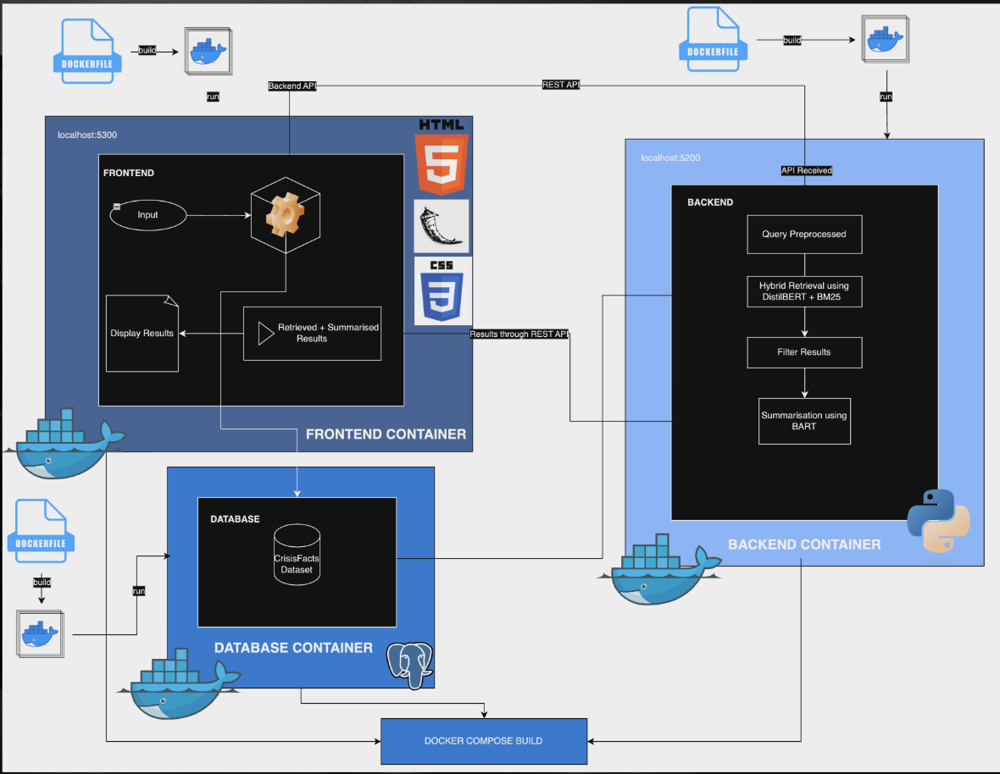
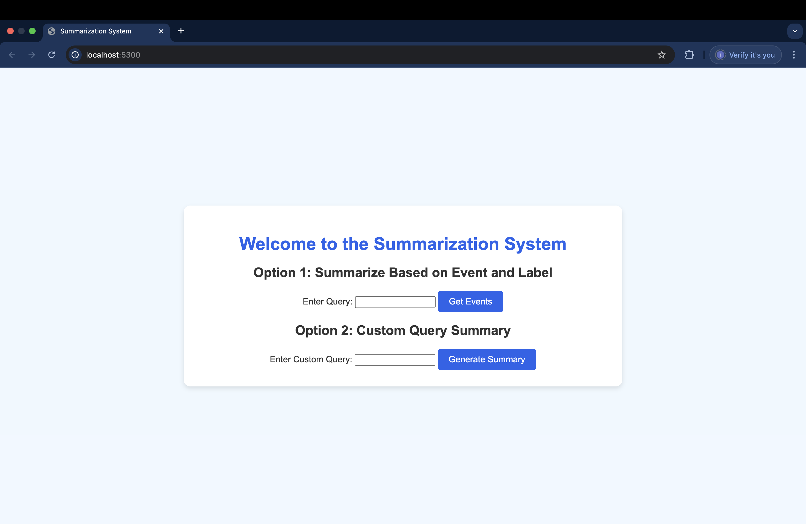
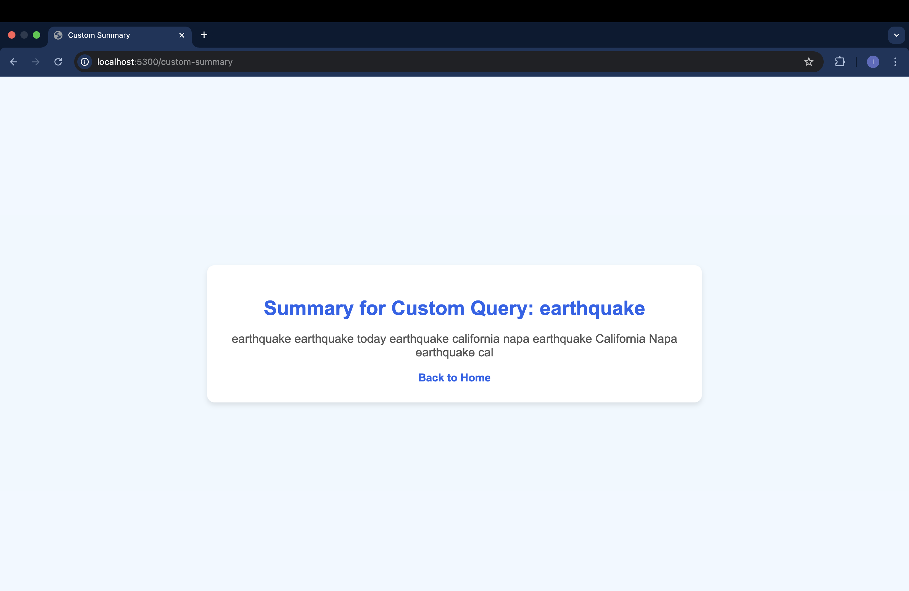

# Crisis Information Retrieval and Summarization

#### Project by: Isfar Baset, Ziyan Di, Sheeba Moghal, Bella Shi and Jacky Zhang

A comprehensive, modular package for tackling the challenges of document retrieval and summarization in large-scale crisis-related datasets. This project is designed to help researchers, analysts, and organizations quickly access critical information during emergencies, enabling effective decision-making and resource allocation. By combining efficient retrieval techniques with advanced summarization capabilities, it empowers researchers, analysts, and organizations to quickly extract and comprehend critical information during emergencies. The system is designed to streamline access to relevant data, enabling informed decision-making and optimized resource allocation in high-pressure situations.

---

## **Overview**

This project addresses the challenge often discussed in class *"we are drowning in information, yet striving for knowledge"* by implementing a robust two-stage document retrieval system combined with summarization capabilities. Designed to handle vast amounts of unstructured data, this solution combines traditional information retrieval techniques with modern machine learning models to extract and summarize relevant information effectively.

### **Key Features**
- **Lexical Retrieval with BM25**:
  Utilizes the BM25 algorithm for fast, keyword-based ranking of documents, ensuring relevant documents are surfaced quickly from large datasets.
  
- **Semantic Retrieval with Dense Embeddings**:
  Enhances retrieval by understanding semantic relationships between documents and user queries through embeddings generated by transformer models.

- **Abstractive Summarization**:
  Generates concise and meaningful summaries of retrieved documents using state-of-the-art transformer-based summarization models, enabling users to quickly grasp the essence of the information.

- **GitHub LFS for Data**:
  Large data files are managed using GitHub LFS. To download the required files, ensure Git LFS is installed and run:
  ```bash
  git lfs pull
  ```

---

## **Installation**

### Using Poetry

```bash
poetry install
```

### Using Pip
```bash
pip install final_project
```

### Using Docker
From the root directory, run:
```bash 
docker-compose up --build
```

---

## **Usage**

### **Running Docker**
```bash
docker-compose up
```
Then, open a browser and navigate to `http://localhost:5300/`.

---

## **Features**

### **Two-Stage Document Retrieval**
- **Stage 1: BM25**  
  Ranks documents based on lexical similarity (e.g., keyword overlap).
- **Stage 2: Dense Embeddings**  
  Refines and re-ranks results based on semantic similarity using transformer-based embeddings.

### **Abstractive Summarization**
- Summarizes retrieved documents for better and more efficient comprehension of large datasets.

---

## **Documentation**

Documentation is generated using Sphinx. To view it locally, open the `index.html` file in a browser:

### MacOS/Linux:
```bash
open docs/_build/html/index.html
```

### Windows:
```cmd
start docs\_build\html\index.html
```

---

## System Architecture


## User Interface

### Landing page:


### Custom Query:


## **Project Structure**

```plaintext
.
├── backend/                # Core backend retrieval and summarization modules
├── data/                   # Raw and processed data files (tracked via GitHub LFS)
├── docs/                   # Sphinx documentation files
├── frontend/               # Frontend integration for user interaction
├── retrieval/              # Retrieval system logic
├── summarization/          # Summarization logic
├── tests/                  # Unit and integration tests
├── requirements.txt        # Dependency file for pip users
├── pyproject.toml          # Poetry configuration file
└── README.md               # Project overview and usage instructions
```

---

## **Testing**

### Run Tests
Validate the system using `pytest`:
```bash
pytest tests/
```

---

## **Contributing**

1. Clone the repository:
   ```bash
   git clone <repo_url> && cd final_project
   ```
2. Install dependencies:
   ```bash
   poetry install
   ```
3. Install pre-commit hooks:
   ```bash
   pre-commit install
   ```
4. Run tests:
   ```bash
   pytest -v tests/
   ```

---

## **Virtual Environment**

This project uses a virtual environment to manage dependencies. A virtual environment ensures that all project-specific dependencies are isolated, avoiding conflicts with other Python projects on your system.

### Using Poetry
1. Install Poetry if not already installed:
   ```bash
   pip install poetry
   ```

2. Navigate to the project directory and install dependencies:
   ```bash
   poetry install
   ```

3. Activate the virtual environment:
   ```bash
   poetry shell
   ```

You’ll notice the virtual environment name (e.g., `(final-project-py3.12)`) in your terminal prompt, indicating it’s active. From here, you can run all commands like tests or scripts.

### Using Pip (Optional)
Alternatively, install dependencies directly without Poetry:
   ```bash
   pip install -r requirements.txt
   ```

---

## **Notes**
- Large files are tracked via GitHub LFS. Ensure you have Git LFS installed and run:
  ```bash
  git lfs pull
  ```
- If you make structural or dependency changes, test the system thoroughly before pushing.
- Keep an eye on GitHub’s **green check marks** to ensure CI/CD workflows pass.

---
